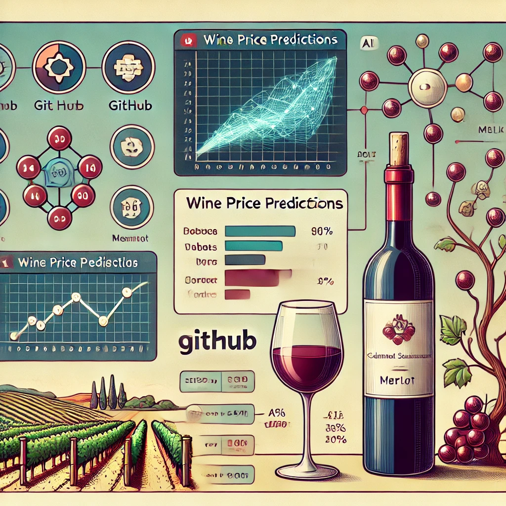
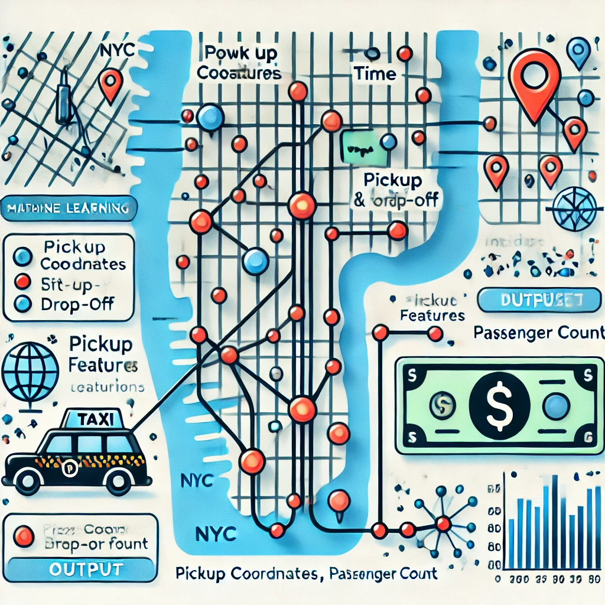

# Nicole Baltodano

🌟 **Data Scientist passionate about Materials Science and AI**  
🌍 Milwaukee, Wisconsin | ✉️ [nicolbaltodano@hotmail.com](mailto:nicolbaltodano@hotmail.com)  
🔗 [LinkedIn](https://www.linkedin.com/in/nicole-baltodano-460941191/) | [GitHub](https://github.com/Nicole-baltodano)

---

## 🔧 Technical Skills

- **Programming Languages**: Python, SQL, VBA  
- **Data Science Tools**: Pandas, NumPy, Scikit-learn, TensorFlow/Keras, XGBoost  
- **Cloud & MLOps**: GCP, Azure, AWS, Docker, FastAPI, Streamlit, MLFlow,   
- **Data Visualization**: Power BI, Tableau, Matplotlib, Seaborn  
- **Other**: Advanced Data Cleaning, Feature Engineering, Statistical Modeling  

---

## 🎓 Education

- **M.S., Data Science**  
  *University of Wisconsin – Milwaukee (2024 – 2025)*  
- **Bootcamp, Data Science and AI**  
  *Le Wagon, Montreal (2023)*  
- **M.S., Metallurgical Engineering**  
  *CINVESTAV, Mexico (2021 – 2023)*  
- **BSc., Chemical Engineering**  
  *UNI, Nicaragua (2014 – 2021)*  

---

## 🚀 Projects

### 1. **[Wine Price Prediction from Review](https://github.com/nicole-baltodano/Wine_price_prediction_from_review)**  
- Designed and trained an NLP model to predict wine prices using over 150,000 wine reviews.  
- Implemented embedding layers, convolutional layers, and dense layers for text analysis.  
- **Result**: Achieved a Mean Absolute Error (MAE) of 12.

  

---

### 2. **[House Prices Prediction](https://github.com/nicole-baltodano/House_prices_prediction)**  
- Developed a regression model to predict house prices using structured data.  
- Performed feature engineering, model selection, and hyperparameter tuning (RandomForest, KNN, XGBoost).  
- **Result**: Achieved an RMSLE score of 0.15 on the test dataset.

  

---

### 3. **[Taxi Fare Prediction](https://github.com/nicole-baltodano/nyc-taxi-fare-prediction)**  
- Built a data pipeline for cleaning, scaling, and encoding features.  
- Trained a regression neural network and deployed an API on Google Cloud Platform.  
- **Result**: Delivered taxi fare predictions with low root main square error (RMSE) of 1.9 on test set.

  

---

### 4. **[Credit Card Fraud Detection](https://github.com/nicole-baltodano/Credit_Card_Fraud_Detection)**
- Developed a data pipeline for preprocessing and addressing class imbalance using SMOTE and undersampling.
- Built and trained a neural network to classify fraudulent transactions with precision-recall optimization.
- Result: Achieved 70% recall for detecting fraudulent transactions on an imbalanced dataset.

  

## 📫 Contact

- **Email**: [nicolbaltodano@hotmail.com](mailto:nicolbaltodano@hotmail.com)  
- **LinkedIn**: [Nicole Baltodano](https://www.linkedin.com/in/nicole-baltodano-460941191/)  
- **Location**: Milwaukee, Wisconsin  
